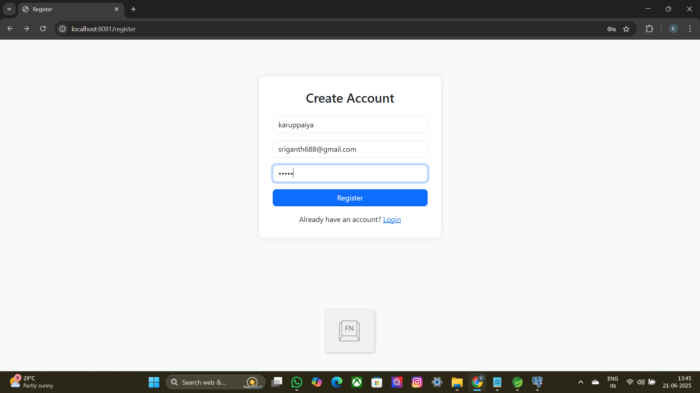
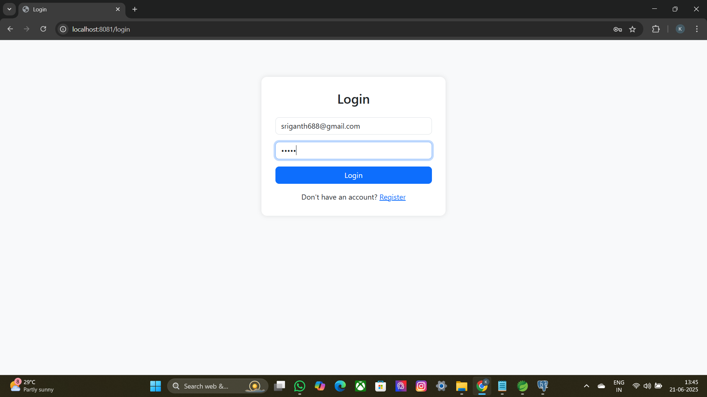
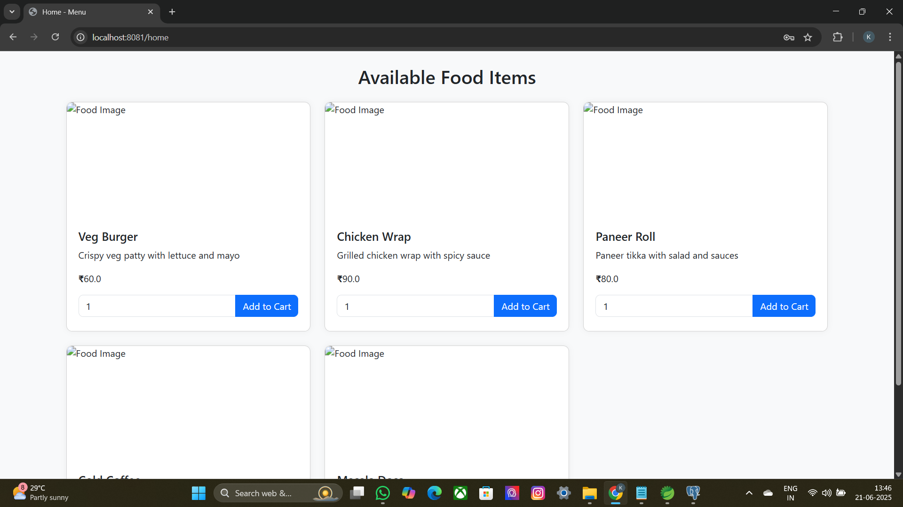
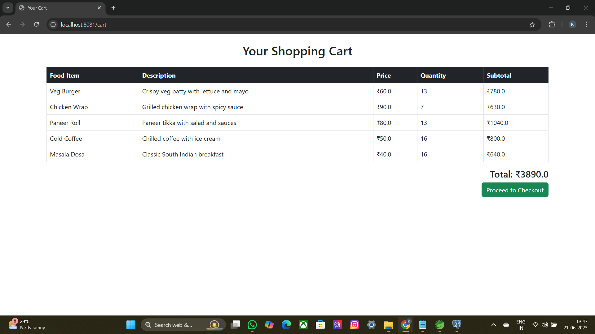
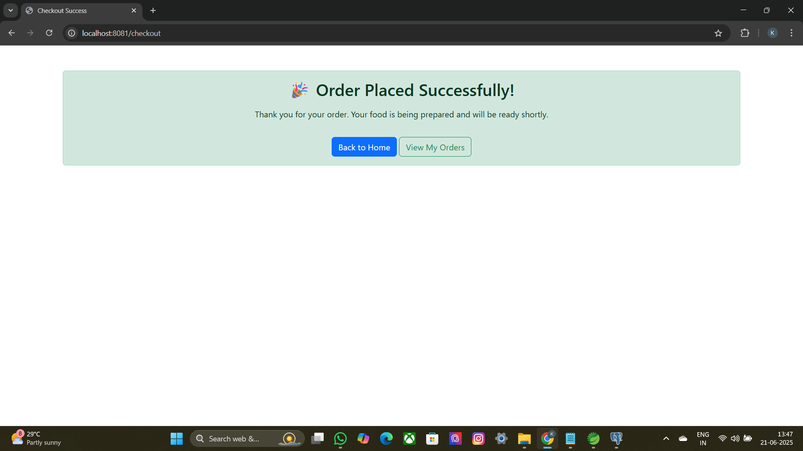

# 🍽️ Online Canteen System

A full-stack web application for online food ordering in a canteen environment.
This project is built using **Spring Boot**, **Spring MVC**, **Thymeleaf**, **PostgreSQL**, and **Bootstrap 5**.

## 🚀 Features

- ✅ User Registration and Login
- ✅ Admin Dashboard for managing food items
- ✅ Users can browse food items and add them to cart
- ✅ Checkout with order placement (COD or online)
- ✅ View past orders
- ✅ Responsive UI built with Bootstrap
- ✅ Session-based authentication and order management

## 🛠️ Technologies Used

- Java 17
- Spring Boot 3.x
- Spring MVC + Thymeleaf
- Spring Data JPA (Hibernate)
- PostgreSQL
- Bootstrap 5
- Eclipse / Spring Tool Suite (STS)

## 📁 Project Structure

## 🔍 Project Preview

>>>>>>> 888df96 (Updated README with project preview screenshots)

